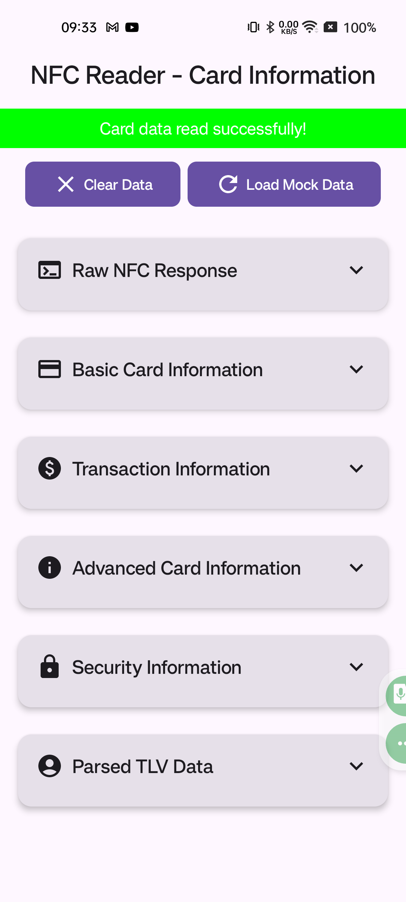
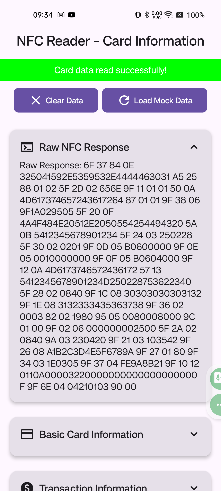
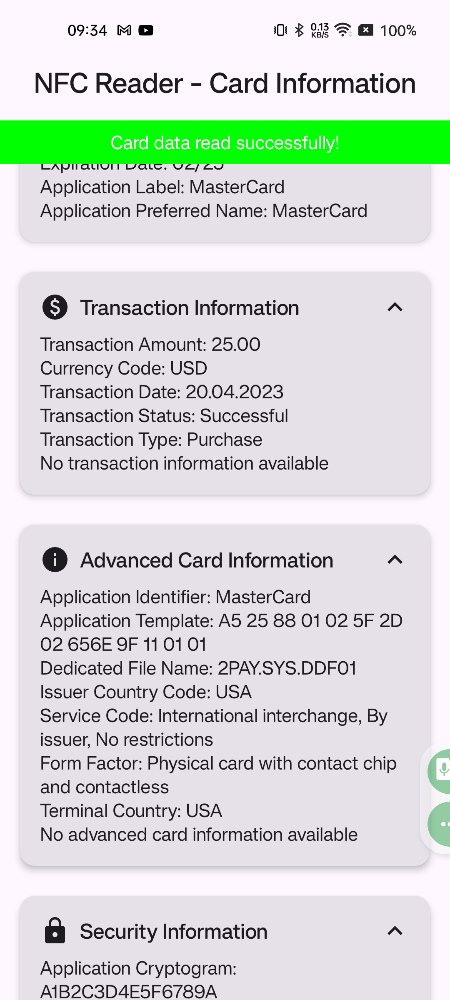
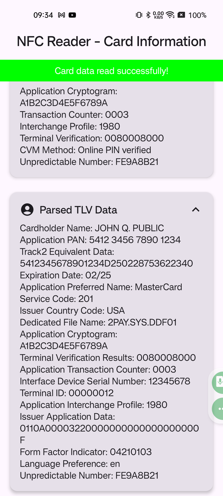

# NFC-CardReader

An Android application for reading and parsing NFC card data, designed with a user-friendly interface and modular architecture. The app leverages **Hilt for dependency injection**, **Jetpack Compose** for the UI, and follows **clean architecture principles**.

---

## Features

- **NFC Tag Reading**: Detect and process NFC tags seamlessly.
- **TLV Parsing**: Extract and interpret key data fields from NFC responses:
  - Cardholder Name
  - Application PAN (Primary Account Number)
  - Expiration Date
  - Application Preferred Name
  - Track 2 Equivalent Data
- **Extended EMV Tag Support**: Process 20+ additional EMV tags including:
  - Application Identifier
  - Application Cryptogram
  - Form Factor Indicator
  - Service Code
  - Issuer Country Code
  - Transaction Type
  - Cardholder Verification Method
- **Comprehensive Information Extraction**:
  - Card Type and Details
  - Transaction Information
  - Security Data
  - Issuer Details
- **Mock NFC Data**: Demonstrate app functionality without requiring NFC hardware.
- **Organized UI**: Collapsible sections for better information hierarchy.

---

## Screenshots

### New UI with Collapsible Sections

The latest version features an improved UI with organized, collapsible sections:

#### Main View


#### Card Information


#### Advanced Information


#### Transaction Details


---

## Usage

1. Launch the app.
2. Place an NFC card near the device's NFC sensor, or use the "Load Mock Data" button.
3. View organized card information in expandable sections:
   - **Basic Card Information**: Cardholder name, card number, expiration date
   - **Transaction Information**: Amount, currency, date, status
   - **Advanced Card Information**: Application ID, issuer country, form factor
   - **Security Information**: Cryptograms, verification methods, counters
   - **Raw NFC Response & Parsed TLV Data**: For technical analysis

---

## Technical Overview

### Architecture

- **UI Layer**: Built with Jetpack Compose for a modern, reactive interface with collapsible sections.
- **Domain Layer**: Includes business logic and use cases for NFC data processing.
- **Data Layer**: Handles NFC data parsing, decoding, and masking.

### Key Technologies

- **Hilt**: Simplifies dependency injection.
- **Kotlin Coroutines**: Enables efficient asynchronous operations.
- **StateFlow**: Manages reactive state updates.
- **Jetpack Compose**: Creates a responsive and modern UI with collapsible sections.
- **Kotlin Symbol Processing (KSP)**: Used for annotation processing instead of KAPT for better compatibility with JDK 16+.

### EMV Tag Processing

The application supports extensive EMV tag processing, including:
- Currency code interpretation
- Service code decoding
- Form factor identification
- Transaction type recognition
- Cardholder verification method analysis

### Module Structure

```
app/
├── src/
│   ├── main/
│   │   ├── java/io/github/romantsisyk/nfccardreader/
│   │   │   ├── app/         # Application class and main activity
│   │   │   ├── di/          # Dependency injection modules
│   │   │   ├── domain/      # Business logic, models and use cases
│   │   │   ├── presentation/ # UI components and ViewModels
│   │   │   └── utils/       # Utility classes for data processing
│   │   └── res/             # Android resources
```

---

## Recent Updates

- Added support for 20+ additional EMV tags
- Redesigned UI with collapsible sections for better organization
- Fixed JDK compatibility issues by migrating from KAPT to KSP
- Enhanced mock data generation for testing
- Improved error handling and logging

---