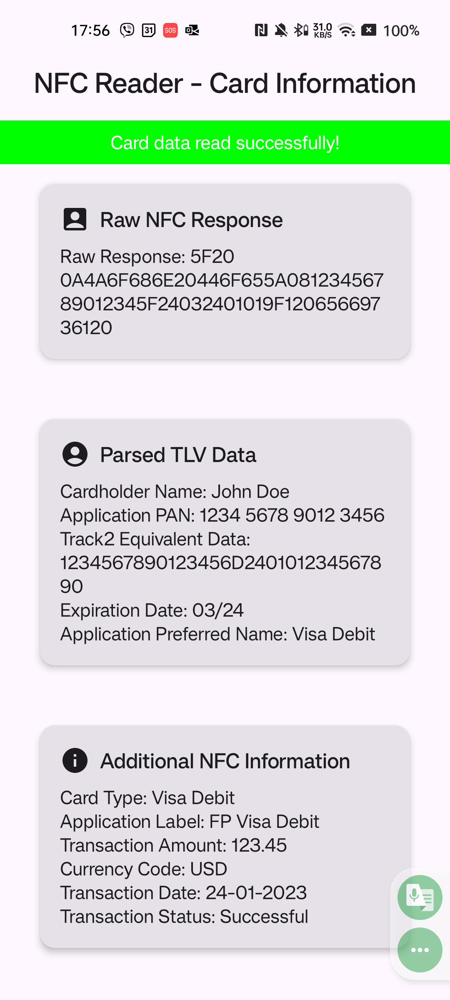

# NFC-CardReader

An Android application for reading and parsing NFC card data, designed with a user-friendly interface and modular architecture. The app leverages **Hilt for dependency injection**, **Jetpack Compose** for the UI, and follows **clean architecture principles**.

---

## Features

- **NFC Tag Reading**: Detect and process NFC tags seamlessly.
- **TLV Parsing**: Extract and interpret key data fields from NFC responses:
  - Cardholder Name
  - Application PAN (Primary Account Number)
  - Expiration Date
  - Application Preferred Name
  - Track 2 Equivalent Data
- **Additional Information Extraction**:
  - Card Type
  - Transaction Amount
  - Transaction Date
  - Transaction Status
  - Currency Code
- **Mock NFC Data**: Demonstrate app functionality without requiring NFC hardware.
- **Dynamic UI**: Real-time updates for raw and processed NFC data.

---

## Screenshots

---

## Usage

1. Launch the app.
2. Place an NFC card near the device's NFC sensor.
3. View:
   - **Raw NFC Response**
   - **Parsed TLV Data**
   - **Additional Information**
4. Use the **mock NFC data** feature for testing without NFC hardware.

---

## Technical Overview

### Architecture

- **UI Layer**: Built with Jetpack Compose for a modern, reactive interface.
- **Domain Layer**: Includes business logic and use cases for NFC data processing.
- **Data Layer**: Handles NFC data parsing, decoding, and masking.

### Key Technologies

- **Hilt**: Simplifies dependency injection.
- **Kotlin Coroutines**: Enables efficient asynchronous operations.
- **StateFlow**: Manages reactive state updates.

---
